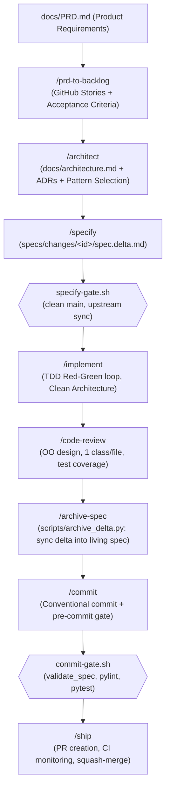

# Antigravity Skills — Specification-Driven Development (SDD) Harness

A comprehensive suite of **CLI-invocable skills** and **zero-token mechanical hooks** that standardize how software systems are architected, specified, implemented, tested, and shipped on an agentic workflow with [Google Antigravity](https://antigravity.google).

The core thesis of this harness:

> **A skill asks; a hook imposes.**  
> Skills carry the **engineering method** (judgment, architecture, progressive refinement). Hooks carry the **enforcement** (mechanical, deterministic, zero-token, blocking on invariant violations). A convention only stated in a prompt is a suggestion — the non-negotiable part is what a gate mechanically checks.

---

## 1. Unified SDD & Agentic Architecture Lifecycle

The plugin unites macro-system architecture (MADR ADRs + Antonio Gulli agentic patterns), multi-modal specification lifecycles (OpenSpec BDD + SDD decision tables), and strict Clean Architecture TDD implementation into an unbroken delivery pipeline:



---

## 2. Skills Catalog (All 8 Grade-A Certified)

Every skill in this repository is certified **Grade A (14/14 = 1.0)** against the agentskills.io specification, equipped with 4-quadrant trigger evaluation datasets and progressive disclosure references.

| Skill | Persona | Description | Primary Tooling / Artifacts |
|---|---|---|---|
| [`/prd-to-backlog`](skills/prd-to-backlog/SKILL.md) | Product Owner | Reconciles PRD requirements into atomic GitHub user stories with acceptance criteria. | GitHub MCP · PO context |
| [`/architect`](skills/architect/SKILL.md) | Macro Architect | Synthesizes system topologies, records MADR ADRs, and selects domain and agentic patterns. | `scripts/pattern_selector.py` · `docs/architecture.md` · `docs/adr/` |
| [`/specify`](skills/specify/SKILL.md) | Tech Lead / Eng | Extracts acceptance criteria into behavioral specifications or scoped delta changes. | `scripts/validate_spec.py` · `SPEC.md` · `specs/changes/<id>/spec.delta.md` |
| [`/implement`](skills/implement/SKILL.md) | Developer | Executes strict TDD Red-Green-Refactor cycles to produce clean OOP domain code. | `pytest` · 1 class/file · `Rule(ABC)` / `StateMachine` |
| [`/code-review`](skills/code-review/SKILL.md) | Reviewer | Audits changes against OO clean architecture, docstring completeness, and test adequacy. | Advisory checklist · prioritized severity |
| [`/archive-spec`](skills/archive-spec/SKILL.md) | Tech Lead / Eng | Splices added/modified rules into capability specs with precedence and moves delta to archive. | `scripts/archive_delta.py` · `specs/archive/<timestamp>-<id>/` |
| [`/commit`](skills/commit/SKILL.md) | Developer | Stages changes and crafts conventional commit messages linking issue, rule, and diff. | `scripts/gates/commit-gate.sh` · End-to-end traceability |
| [`/ship`](skills/ship/SKILL.md) | Release Eng | Validates PR status, monitors CI check suites, squash-merges into main, and cleans branches. | GitHub MCP / `gh` CLI · CI gate |

---

## 3. Specification Architecture: Living Specs & Deltas

The harness supports both standalone specifications (`SPEC.md` or `specs/<capability>/spec.md`) and scoped delta specifications (`specs/changes/<id>/spec.delta.md`):

```
specs/
├── <capability>/
│   └── spec.md                    # Living, cumulative source of truth
├── changes/
│   └── <issue-id>/
│       └── spec.delta.md          # Active proposed change
└── archive/
    └── <YYYYMMDD-HHMMSS>-<id>/   # Archived completed changes
```

### The Hybrid Specification Standard
The validator and archiver support canonical OpenSpec BDD, SDD Decision Tables, and the unified **Hybrid Standard**:

```markdown
# Specification: Pricing Engine
- **Capability**: pricing

## Purpose
Decide whether a purchase is approved, denied, or flagged for review.

## Requirements

### Requirement R1: Small purchase auto-approval
The system SHALL automatically approve purchases under $100.

#### Scenario: Small purchase
- **GIVEN** an active account with good standing
- **WHEN** purchase amount is $45
- **THEN** outcome is APPROVE with rule_ids=["R1"]

### Requirement R2: High-value purchase manual review
The system SHALL route purchases over $500 to compliance review.
- **Precedence**: Evaluated before R1

## Precedence order
1. R2 — High-value purchase manual review
2. R1 — Small purchase auto-approval
```

### Delta Synchronization Lifecycle (`/archive-spec`)
When an issue is implemented and tested:
1. `scripts/archive_delta.py` reads `specs/changes/<id>/spec.delta.md`.
2. Rules under `## ADDED Requirements` are spliced into `specs/<capability>/spec.md`.
3. Precedence hints (`- **Precedence**: before/after Rn, first, last`) are parsed, spliced at the exact position, and the ordered precedence list is re-indexed.
4. Rules under `## MODIFIED Requirements` update the requirement body in-place and re-synchronize title changes in `## Precedence order`.
5. Rules under `## REMOVED Requirements` are excised from both requirements and precedence tables.
6. The delta directory is moved to `specs/archive/<timestamp>-<id>/` preserving a permanent audit trail.

---

## 4. Architectural Pattern Catalog & Selection

The `/architect` skill integrates Antonio Gulli’s 21 Agentic Design Patterns with 5 core Computational Domain Shapes:

### Domain Computational Shapes
- **`decision-list`**: Request-in / decision-out with boolean predicates (`Rule(ABC)` + `engine.py`).
- **`repository-service`**: Entity lookup, caching, and persistence (`Repository(ABC)` + `service.py`).
- **`state-machine`**: Event-driven lifecycles and sagas (`State`, `Event`, `StateMachine(ABC)`).
- **`pipeline-reducer`**: Stream transformations and accumulating calculators (`PipelineStage(ABC)`).
- **`algorithmic-core`**: Solvers, tree traversals, and optimization (`Solver(ABC)`).

### Pattern Recommendation Tool
Run the heuristic pattern analyzer with transparent fallback reporting:
```bash
python3 scripts/pattern_selector.py "Evaluate input purchase against risk ceiling and flag for human review"
```
```
=================================================================
           UNIFIED PATTERN SELECTION RECOMMENDATION              
=================================================================

1. DOMAIN COMPUTATIONAL PATTERN:
   Pattern:     decision-list (confidence: high, matched: rule, evaluate)
   Description: Request-in / decision-out with boolean predicates (Rule(ABC) + engine.py)

2. AGENTIC DESIGN PATTERNS (Antonio Gulli Catalog):
   - [Tier 3: Advanced] Ch 13: Human-in-the-Loop [matched: human review]
     Intent: Pause execution for human approval, feedback, or exception handling.
   - [Tier 1: Core] Ch 5: Tool Use [matched: tool]
     Intent: Ground model actions in external tools, APIs, and computational functions.
   - [Tier 4: Enterprise] Ch 18: Guardrails & Safety
     Intent: Input/output filtering, PII masking, jailbreak defense, and schema enforcement.

3. COMPOSITION GUIDANCE:
   Combine the primary Domain Pattern for core logic with selected Agentic Patterns for control & safety.
=================================================================
```

---

## 5. End-to-End Traceability Convention

Every commit made via `/commit` strictly enforces end-to-end traceability linking the GitHub Story, git commit, domain rule ID, and production runtime audit log:

```
feat(scope): summary [Rn] (#issue)
```

```python
# Production Runtime Decision Record
Decision(
    outcome="REVIEW",
    rule_ids=["R2"],
    reason="Purchase over $500 threshold",
    evaluated_at="2026-09-17T12:00:00Z"
)
```

An auditor observing a `REVIEW` in production can trace:  
`Runtime Decision (rule_ids=["R2"])` $\rightarrow$ `Git Commit ([R2] (#70))` $\rightarrow$ `GitHub Story (#70)` $\rightarrow$ `PRD Acceptance Criteria`.

---

## 6. Mechanical Gates & Hook Enforcement

Antigravity hooks run outside the model context loop and enforce invariants deterministically:

```
scripts/
├── pre-tool-use.sh      # Entry router registered in hooks.json
├── lib/hook-io.sh       # Shared hook_allow / hook_deny JSON formatting
└── gates/
    ├── specify-gate.sh  # Blocks branch cuts if working tree is dirty or main is behind upstream
    └── commit-gate.sh   # Blocks git commit if spec fails validation, tests fail, or linter errors exist
```

---

## 7. Development & Quality Verification

Core runtime scripts depend **only on the Python Standard Library** (zero third-party runtime bloat). Optional dev tools (`pytest`, `pytest-cov`, `pylint`) are configured in `pyproject.toml`.

### Running Tests
```bash
# Via standard library unittest (zero dependencies)
python3 -m unittest discover -s tests

# Or via pytest with coverage
pytest --cov=scripts tests/
```

### Running Linter
```bash
# Enforces clean imports, type annotations, and docstrings (10.00 / 10 clean)
pylint scripts/archive_delta.py scripts/pattern_selector.py scripts/validate_spec.py tests/test_core_scripts.py
```

### Scoring Skills Quality
```bash
python3 ~/.gemini/config/plugins/meta-skills/skills/skill-evaluator/scripts/score_skill.py skills/architect
```

---

## 8. License & Acknowledgements

- Built for **Google Antigravity**.
- Incorporates concepts from **Antonio Gulli's *Agentic Design Patterns***, **OpenSpec**, and **Clean Architecture**.
- Licensed under the Apache-2.0 License.
